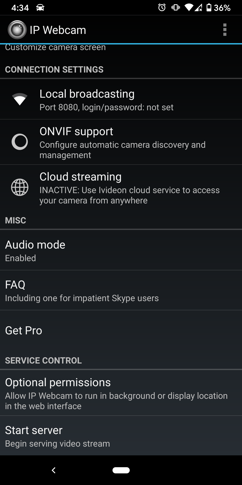

# Phone-Camera-Stream
Capture and stream video from phone camera using openCV and python

## APP Requirements 
Download IP Camera app from Google Play or App Store 

## Running the App 
Open the app and click on 'Start Server' to begin streaming. In order to run the application in background, select 'Optimal permission'. 

### IP Address Setup 
Once server is started on your app, a video stream will show on your phone screen with ipV4 address on top of it. Replace the IP address in URL variable of python program. 

### Saving the Video 
Set saveVideo True if you would like to save video on your disk. Video will be saved in downloads folder created in your working directory. 

## Warnings 
1. When phone application is in use, phone battery may drain out faster than usual 
2. It is recommended to setup username and password on IP Camera App as others connected to your network may acccess the camera 

